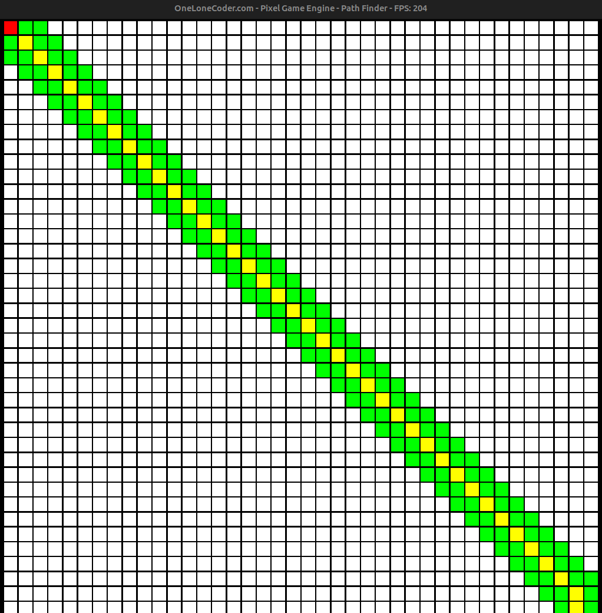

# pathfinder
Maze PathFinder in C++

# Objective
The main objective of this project is to implement various searching algorithm that finds the correct path to the destination provided both the start and end points.

In the above image the yellow blocks are the path traced by the algorithm to reach its destination from a certain start point (in red). The Green blocks are the path explored but not chosen.
